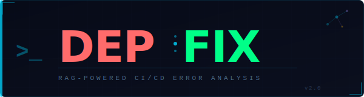

<p align="center">
  
</p>

<p align="center">
  <strong>Self-hosted, RAG-powered CI/CD error analysis — no cloud, no leaks, all local.</strong><br/>
  <sub>Built with Ollama · pgvector · FastAPI · Next.js</sub>
</p>

<p align="center">
  <a href="#quick-start">Quick Start</a> ·
  <a href="#features">Features</a> ·
  <a href="#architecture">Architecture</a> ·
  <a href="#ci-cd-integration">CI/CD Integration</a> ·
  <a href="#configuration">Configuration</a> ·
  <a href="#docs">Docs</a>
</p>

---

## What is DEPFIX?

DEPFIX runs entirely on your own hardware. When a CI/CD job fails, it ships the failure log to your local DEPFIX instance, which uses Retrieval-Augmented Generation to search thousands of pages of official library documentation and produce a specific, grounded fix — not hallucinated guesses.

| Without DEPFIX | With DEPFIX |
|---|---|
| Read the raw log, google the error, guess | Paste your DEPFIX URL, get a cited answer |
| LLM answers from stale training data | Answers grounded in live, scraped docs |
| Logs leave your network | Everything stays on your machine |

---

## Features

- **RAG Engine** — pgvector similarity search over scraped library docs (PyTorch, MONAI, scikit-learn, TorchAudio, TorchVision, TensorSeal, Waitress, Requests, Pyramid, …)
- **Multi-Agent Architecture** — orchestrator routes between intent analysis, dependency resolution, error extraction, and solution generation agents
- **Ollama Integration** — run any local model (Llama, Mistral, Gemma, …); model pull + VRAM recommendation built in
- **GitHub Actions & GitLab CI** — one-step webhook integration; failure logs arrive automatically
- **Drag-and-Drop Dashboard** — paste or drop a log directly; session history; connection status bar
- **Setup Wizard** — 6-step guided setup with hardware detection, WSL2 warnings, Docker health check
- **Local-First** — PostgreSQL + pgvector on Docker; no external API keys required

---

## Quick Start

```bash
# 1. Clone
git clone https://github.com/navid-ahsan/RAG-for-CI-CD.git
cd RAG-for-CI-CD

# 2. Copy and fill env
cp .env.example .env
# edit .env — set POSTGRES_PASSWORD, DEPFIX_WEBHOOK_SECRET, GITHUB_ID, GITHUB_SECRET

# 3. Start services
docker-compose up -d

# 4. Install Python deps (for local dev / scripts)
python -m venv .venv && source .venv/bin/activate
pip install -r requirements.txt

# 5. Start the backend
uvicorn backend.app.main:app --reload --port 8000

# 6. Start the frontend
cd frontend && npm install && npm run dev
```

Open **http://localhost:3000** — the setup wizard will guide you through the rest.

---

## Architecture

```
┌─────────────────────────────────────────────────────┐
│  Next.js 14 Frontend  (App Router, dark DEPFIX UI)  │
│  /main  /setup/*  /dashboard                        │
└────────────────────┬────────────────────────────────┘
                     │ REST / SSE
┌────────────────────▼────────────────────────────────┐
│  FastAPI Backend  (backend/app/)                    │
│                                                     │
│  api/          rag.py  logs.py  analysis.py         │
│                system.py  ollama_routes.py          │
│                webhook.py  config.py  …             │
│                                                     │
│  agents/       orchestrator → intent_analyzer       │
│                                                     │
│  services/     rag_service  embedding_service       │
│                log_service  github_service  …       │
└────────┬───────────────────┬────────────────────────┘
         │                   │
┌────────▼──────┐   ┌────────▼──────────────────────┐
│  Ollama        │   │  PostgreSQL + pgvector         │
│  (local LLM)   │   │  (vector embeddings + logs)    │
└────────────────┘   └────────────────────────────────┘
```

---

## CI/CD Integration

### GitHub Actions

Add to any job that should be monitored. The only secret needed is `DEPFIX_URL`.

```yaml
- name: Send failure log to DEPFIX
  if: failure()
  run: |
    jq -n \
      --arg wf   "${{ github.workflow }}" \
      --arg run  "${{ github.run_id }}" \
      --arg repo "${{ github.repository }}" \
      --arg ref  "${{ github.ref_name }}" \
      --arg sha  "${{ github.sha }}" \
      --arg log  "$(cat job.log 2>/dev/null || echo '')" \
      '{workflow_name:$wf,run_id:$run,repository:$repo,branch:$ref,commit_sha:$sha,conclusion:"failure",log_content:$log}' \
    | curl -sf -X POST "${{ secrets.DEPFIX_URL }}/api/v1/webhook/github-actions" \
        -H "Content-Type: application/json" -d @-
```

### GitLab CI

Add to any job's `after_script`. Set `DEPFIX_URL` in **Settings → CI/CD → Variables**.

```yaml
after_script:
  - |
    if [ "$CI_JOB_STATUS" = "failed" ]; then
      jq -n \
        --arg wf   "$CI_JOB_NAME" \
        --arg run  "$CI_PIPELINE_ID" \
        --arg repo "$CI_PROJECT_PATH" \
        --arg ref  "$CI_COMMIT_BRANCH" \
        --arg sha  "$CI_COMMIT_SHA" \
        --arg log  "$(cat job.log 2>/dev/null || echo '')" \
        '{workflow_name:$wf,run_id:$run,repository:$repo,branch:$ref,commit_sha:$sha,conclusion:"failure",log_content:$log}' \
      | curl -sf -X POST "${DEPFIX_URL}/api/v1/webhook/github-actions" \
          -H "Content-Type: application/json" -d @-
    fi
```

> **Tip:** Pipe your build command through `2>&1 | tee job.log` to capture stdout + stderr.

Full integration templates: [`.github/workflows/`](.github/workflows/) · [`.gitlab-ci.yml`](.gitlab-ci.yml)

---

## Configuration

All settings are managed through the DEPFIX Setup Wizard UI or via `.env`:

| Variable | Description |
|---|---|
| `OLLAMA_HOST` | Ollama base URL (default: `http://localhost:11434`) |
| `DATABASE_URL` | PostgreSQL connection string with pgvector |
| `DEPFIX_WEBHOOK_SECRET` | HMAC-SHA256 secret for webhook signature verification |
| `GITHUB_ID` / `GITHUB_SECRET` | GitHub OAuth app credentials |
| `NEXTAUTH_SECRET` | NextAuth secret (any random string) |
| `NEXT_PUBLIC_API_URL` | Backend URL visible to the browser |

Copy `.env.example` to `.env` and fill in the values.

---

## Supported Libraries (RAG Knowledge Base)

Pre-scraped documentation is included for:

`pytorch` · `monai` · `scikit-learn` · `torchaudio` · `torchvision` · `tenseal` · `waitress` · `requests` · `pyramid` · `flower`

Add more by editing `backend/app/services/setup_service.py` and running the embedding pipeline from the Setup Wizard.

---

## Docs

| Document | Description |
|---|---|
| [docs/DEVELOPMENT.md](docs/DEVELOPMENT.md) | Architecture deep-dive, local dev setup, adding new agents |
| [docs/DEPLOYMENT.md](docs/DEPLOYMENT.md) | Docker Compose, production hardening, GPU setup |
| [docs/TEST_RESULTS.md](docs/TEST_RESULTS.md) | Test suite results and coverage metrics |

---

## Tech Stack

| Layer | Technology |
|---|---|
| Frontend | Next.js 14 (App Router), NextAuth, Tailwind-free custom CSS |
| Backend | FastAPI, SQLAlchemy, Alembic |
| Vector DB | PostgreSQL 16 + pgvector |
| LLM / Embeddings | Ollama (Llama 4, Gemma 3, Mistral, nomic-embed-text, …) |
| RAG | LangChain, custom chunking + retrieval pipeline |
| Testing | pytest, RAGAS evaluation metrics |
| CI / CD | GitHub Actions, GitLab CI (both supported) |
| Deployment | Docker Compose, Kubernetes (Helm charts in `deploy/`) |

---

<p align="center">
  <sub>DEPFIX — keep your errors local, keep your fixes grounded.</sub>
</p>
